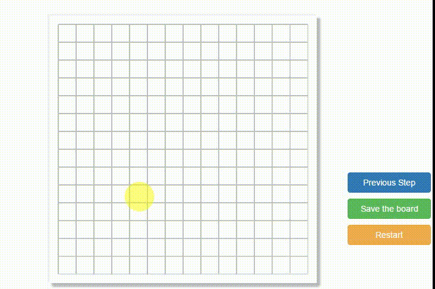

###GoBang Game in JavaScript with navtive AI

This is a program which implement the game Go-Bang .It also called as "Five in a Row".You can drop a piece by single-click on the board.

After five piece which are in the same color connected on a line, the game end.

This is a game with a in-built AI, which means that user can play the game 
with the program and the AI will try it's best to beat you in this game.

I add a awesome feature in this program. You can undo your action by clicking the button "Previous Step".

After the game or in the middle of the game, you could click the green button "Save the board" if you want to save the representation of the current game.

You can restart the game with a clean borad with the help of the button "restart".

Demo:

[On YouTube](https://www.youtube.com/watch?v=6JA6wZletX4)

 

Current Version: 3.1

### Version

3.1 : Attributes ==> Show where is the last dropped peice  
3.0 : With a better friendly user interface.  
2.0 : Support to download history steps as json files.  
1.2 : Attributes ==> The program will download the history steps after game over.  
1.1 : Attributes ==> Support back step.  
1.0 : A basic implementation of GoBang with AI.  

### Helpful documents

https://www.cs.cornell.edu/courses/cs312/2002sp/lectures/rec21.htm  

https://en.wikipedia.org/wiki/Minimax  

https://www.zhihu.com/question/34816738  

https://www.zhihu.com/question/24053236?rf=27577220  

https://project.dke.maastrichtuniversity.nl/games/files/phd/SearchingForSolutions.pdf  