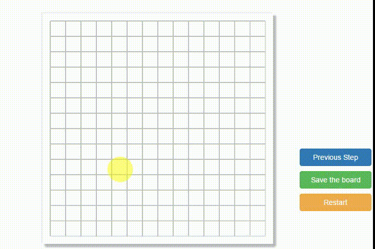

### GoBang Game in JavaScript with navtive AI

**当前版本: 3.7**

### 简要介绍

这是一个核算算法全部由JavaScript实现的五子棋程序(GoBang, Gomuku)。本项目仅做技术交流使用，禁止在未经授权的情况下以任何形式用于商业目的。

人类用户先行，黑白双方轮流落子。率先在横、竖、斜方向上成五（连续五个己方棋子）者为胜，对弈结束。AI模块会根据局面情况，仅其所能去防守，甚至尝试打败用户。

动态演示图:



同样可以通过[GoBang-AI 介绍视频](https://www.youtube.com/watch?v=6JA6wZletX4)对本项目做简要的了解。

由于这是EOF第一次写JavaScript项目，程序实现的风格上，会贴近于面向对象的风格，开发者通过源代码会很明显的发现EOF尝试通过JavaScript的函数作用域去实现类似于Namespace的技术，以便于模块职能的划分解耦。


程序主要包含三个模块启动运行模块、用户界面模块、走法记录模块以及人工智能模块。

支持的特性有：

* 悔棋。人类用户可以通过用户界面的回退按钮撤销AI的落子以及自己的落子，但必须保证回退到自己的回合，否则用户界面不允许用户落子。  

* 棋局存档。当用户触发交互界面的存档按钮之后，程序会自动的讲棋局表示的关键信息已JSON文件的形式下载到本地。该文件可用于后期分析棋局或开发调试时复盘使用。

* 复盘。用户通过触发交互界面的文件上传按钮，上传棋局存档文件，程序解析并根据存档文件恢复棋局。

* 重新开始。在行棋的任何时候，用户都可以通过触发重新开始的按钮重置棋局，并开始新的对局。

### 实现相关技术和概念

* JavaScript
程序实现完全采用了前端技术，主要核心语言是JavaScript。初期这样做技术选型的原因仅仅是出于快速验证算法正确性的考虑，于是以前端单页面应用的方式呈现。开发者完全可以考虑采用前后端分离的方式，以Server-Browser架构的方法。自行将AI核心算法用C语言或者其他执行效率更高的语言去作为后端实现。

* 赢法数组
与围棋、象棋等博弈类项目不同，五子棋规则简易，棋局规模**相对**较小，故可以穷举出固定尺寸棋盘内的所有赢法。实现上，采用了赢法数组这一简易数据结构去储存所有可能的赢法。

* Min-Max Search
号称“机器智能博弈的基石”的Min-Max搜索算法为AI模块提供的搜索算法之一。实质上是一种深度优先搜索算法的变种。
Min-Max搜索算法的伪代码如下：
```

01 function minimax(node, depth, maximizingPlayer)
02     if depth = 0 or node is a terminal node
03         return the heuristic value of node

04     if maximizingPlayer
05         bestValue := −∞
06         for each child of node
07             v := minimax(child, depth − 1, FALSE)
08             bestValue := max(bestValue, v)
09         return bestValue

10     else    (* minimizing player *)
11         bestValue := +∞
12         for each child of node
13             v := minimax(child, depth − 1, TRUE)
14             bestValue := min(bestValue, v)
15         return bestValue

```


* Alpha-Beta Search
由于Min-Max搜索算法会遍历局面所有的情况，这其中某些局面虽然走法不同，但其“博弈价值”可能完全一样，而我们只能去其中最优，故可能存在重复评估(计算)的情况。为避免这种情况的发生，可以考虑采用Alpha-Beta剪枝方法对原有的Min-Max做改进，使得搜索算法的性能大幅度提升。

* Principal Variation Search
对Alpha-Beta搜索算法的进一步优化。

### 下一的工作
* Zobrist hashing 加速剪枝
* PVS search

### 常见问题问答

Q.赢法数组是什么含义？

A. 

``` javascript

var diffWayToWin;   // Different way to win
var waysToWin = [];

```

在AI模块内部，变量diffWayToWin用来描述整个棋局所有可能的赢法，即一共有多少种“五子连珠”的可能。
waysToWin是一个三维数组，前两个维度waysToWin\[x\]\[y\]表示棋局的某个位置(x, y)。第三个维度waysToWin\[x\]\[y\]\[k\]表示棋盘上的某个位置是否属于第k种赢法，一共有diffWayToWin种赢法。

Q.如何对不同的局面做评估？

A.局面评估是任何棋类AI程序的核心算法之一，评估函数的好坏直接关系到AI程序棋力的强弱。搜索方面，程序会对__全局__进行搜索。评估方面，我采用了对不同棋子连接情况进行评分估值，具体参数设置当前为本人的开发调试经验值（也有参考相关论文，但发现价值评估参数有bug）。如果可行的话，我希望下一步能够通过机器学习的方式通过大规模的AI自己与自己博弈，完成参数的调整，收敛到近似最优值。

Q.现在按照这种算法，AI可以考虑多少步？性能如何？

A.3步。可能会针对特殊的情况做搜索深度的调整，目前最深为3步。即用户落子之后，AI会自动模拟自身与用户交替落子，共计三步棋，之后不再进一步搜索。性能方面，在Alpha-Beta搜索的支持下，在9x9棋盘规模下，AI每一轮落子大概在1s ~ 15s不定。


### 版本变动情况

3.8 : Attributes ==> Add Alpha-Beta Search
3.7 : Fix Bug in Board.legalIndex(row, col).  
3.6 : Attibutes  ==> Recover from history steps json files.  
3.5 : Fix the bug on the attributes "Back Step";  
3.1 : Attributes ==> Show where is the last dropped peice  
3.0 : With a better friendly user interface.  
2.0 : Support to download history steps as json files.  
1.2 : Attributes ==> The program will download the history steps after game over.  
1.1 : Attributes ==> Support back step.  
1.0 : A basic implementation of GoBang with AI.  

### 相关文献与资料

https://www.cs.cornell.edu/courses/cs312/2002sp/lectures/rec21.htm  
https://en.wikipedia.org/wiki/Minimax  
https://www.zhihu.com/question/34816738  
https://www.zhihu.com/question/24053236?rf=27577220  
https://project.dke.maastrichtuniversity.nl/games/files/phd/SearchingForSolutions.pdf  
[Whipping File Inputs Into Shape with Bootstrap 3](https://www.abeautifulsite.net/whipping-file-inputs-into-shape-with-bootstrap-3)  
[Othello Sky](http://www.soongsky.com/computer/mtdf.php)  
[Principal Variation Search](https://en.wikipedia.org/wiki/Principal_variation_search)    
